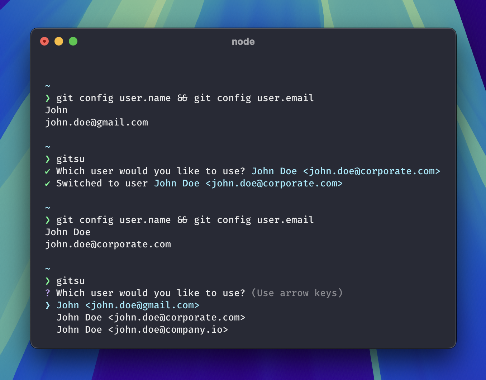

# gitsu

> 🥷 Command line util for quickly & easily switching git identities

[](https://github.com/jamieweavis/gitsu/actions)
[](https://npmjs.com/package/gitsu-cli)
[](https://github.com/jamieweavis/gitsu/releases)
[](https://github.com/jamieweavis/gitsu/blob/main/LICENSE)



## Install

```sh
npm install gitsu-cli -g
```

## Usage

Open the `gitsu` switcher to select a user from your `~/.gitsurc` config
```sh
gitsu
```

List users stored in your `~/.gitsurc` config
```sh
gitsu --list
gitsu -l
```

Open your `~/.gitsurc` config for editing in your default editor
```sh
gitsu --edit
gitsu -e
```

## Building

Compiling a production build
```sh
npm run build
```

Running in development mode
```sh
npm run dev
```

Running a production build
```sh
npm start
```

## Linking

Link the local package to your global npm modules
```sh
npm link
```

Unlink the local package from your global npm modules
```sh
npm unlink gitsu-cli -g
```

## Config

When you run `gitsu` for the first time, a `.gitsurc` file is created in your home directory. This file is used to store your git identities.

```json
[
  { "name": "John", "email": "john.doe@gmail.com" },
  { "name": "John Doe", "email": "john.doe@corporate.com" },
  { "name": "Johnny", "email": "johnny@startup.io" }
]

```

## Built With

- [Node.js](https://github.com/nodejs/node)
- [TypeScript](https://github.com/microsoft/TypeScript)
- [Commander.js](https://github.com/tj/commander.js)

## License

This project is licensed under the MIT License - see the [LICENSE](LICENSE) file for details.
